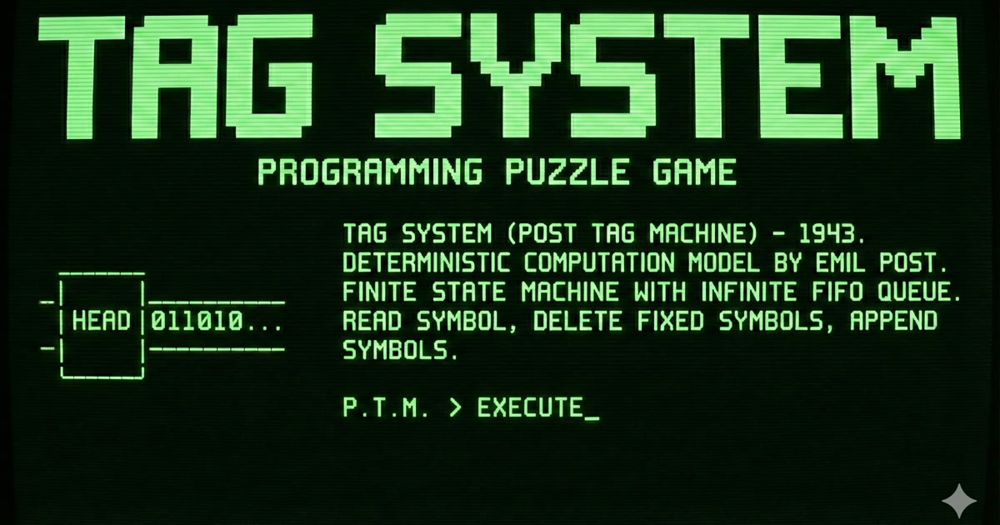

<div align="center">
  
</div>

# Tag System

Emil Post のタグシステム（1943年）を題材にしたインタラクティブな学習パズルゲーム。
単純な文字列書き換えルールが、いかにしてチューリング完全な計算を実現するかを体感する。

## タグシステムとは

タグシステムは以下の要素で定義される計算モデルです。

- **削除数 m** — 各ステップで先頭から削除する文字数
- **書き換えルール** — 先頭文字に対応する文字列を末尾に追加するルール（例: `A → XYZ`）

各ステップでは、入力文字列の先頭文字を読み取り、対応するルールの文字列を末尾に追加し、先頭 m 文字を削除します。
これを繰り返すことで、チューリング完全な計算ができます。

https://ja.wikipedia.org/wiki/%E3%82%BF%E3%82%B0%E3%82%B7%E3%82%B9%E3%83%86%E3%83%A0

https://dl.acm.org/doi/10.1145/321203.321206

## 主な機能

- **ルールエディタ** — `A → XYZ` 形式でルールを記述
- **ステップ実行** — 各ステップの削除・追加を可視化しながらデバッグ
- **テストケース検証** — 複数のテストケースに対して一括で合否判定
- **Markdown 対応の問題文** — LaTeX 数式・表を含むリッチな問題記述
- **進捗の永続化** — レベルごとのルールを localStorage に保存

## セットアップ

**前提条件:** Node.js ≥ 20.19.0

```bash
npm install
npm run dev
```

ブラウザで `http://localhost:3000` を開きます。

## 開発コマンド

```bash
npm run dev        # 開発サーバー起動
npm run build      # プロダクションビルド
npm run preview    # ビルド結果のプレビュー
npm run test       # テスト実行
npm run lint       # 型チェック
```

## 技術スタック

- **React 19** + **TypeScript**
- **Vite 6** — ビルドツール
- **Tailwind CSS 4** — スタイリング
- **TanStack Router** — クライアントサイドルーティング
- **unified** + **KaTeX** — 数式付き Markdown レンダリング
- **Vitest** — テストフレームワーク
